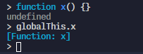
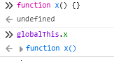

# Funciones

La declaración de una función crea un vinculo entre una nueva función y un nombre.

La declaración es la siguiente

```javascript
function nombre(parametros) {
  sentencias;
}
nombre("Parametro_1");
```

### nombre

Esta parte es el nombre de la función que se vinculara para ser usada, es usado de la forma `nombre()`

### parametros

Los parametros son usados para darle una entrada de datos a la función, cada uno debe ser nombrado y hay un limite de 255 argumentos para cada función

```javascript
function nombre(parametro_1, parametro_2, parametro_3) {}
```

### sentencias

Las sentencias comprenden el cuerpo de la función, en el siguiente ejemplo se usa la sentencia `return` para devolver información de una función.

```javascript
function nombre() {
  return "Hola";
}
```

En el ejemplo anterior la función `nombre` siempre regresa la cadena `"Hola"` como resultado de llamar a la función de la siguiente manera `nombre()`

### Notas

Cada vez que llames una función devolverá su primer `return` ejecutado, si llega al final de la funcion sin encontrar un `return` devuelve `undefined`

Las declaraciones de funciones se comportan como un mix de `var` y `let`:

- Como `let` en modo estricto, las declaraciones de funciones están acotadas al bloque que las contiene mas cercano

```javascript
{
  // bloque 1

  {
    // bloque 2
    function x() {
      console.log("ey");
    }
    x(); // funciona y llama a x
  }
  x(); //marca un error
  //Uncaught ReferenceError ReferenceError: x is not defined
}
```

- Como `let` funciones declaradas al nivel mas alto de un **modulo** o en **bloques en modo estricto** no pueden ser re declaradas por ninguna otra declaración

```javascript
function x() {}
x();

function x() {} //error: Uncaught SyntaxError: Identifier 'x' has already been declared
```

Esta es valida

```javascript
function x() {
  console.log("top");
}
x();
{
  // comienza el bloque_1
  function x() {
    //esta función tomara el nombre x dentro de bloque_1
    console.log("block");
  }
  x();
} // se termina el bloque_1
x();
//Genera los logs
/*
top
block
top*/
```

- Como `var`, declaraciones de funciones en un `script` se añaden como propiedades del global this, y pueden ser re declaradas. en las siguientes dos imagenes se muestra como se añaden al `globalThis`, esto solo pasa en el `REPL` o tambien llamada `Interactive Top-Level`, para entornos como `Deno` o scripts en las paginas `Html`, en modulos las funciones no se agregan al `globalThis`





Si ejecuto este codigo como modulo el resultado del console.log sera undefined, apesar de que el `REPL` si devuelve la función

```javascript
function x() {}
console.log(globalThis.x);
```

- Como ambas se puede re-asignar, pero deberias evitar hacerlo
- Como ninguna de las dos, las funciones son `hoisted`(izadas) juntas con su valor y pueden ser llamadas en cualquier lugar que esten en el scope que las contiene, veremos mas adelante que es el `hoisting`

Nota de pie:
Esta leccion solo enseña como se crean las funciones mas basicas y algunas curiosidades, de las funciones, mas adelante veremos como usarlas, y diferentes tipos de declaraciones de funciones como los generadores(generators) `function*`, las `async function` y `async function*`, las funciones flechas `arrow function` y definicion de metodos.

Referencias:

- [MDN function statement](https://developer.mozilla.org/en-US/docs/Web/JavaScript/Reference/Statements/function)
